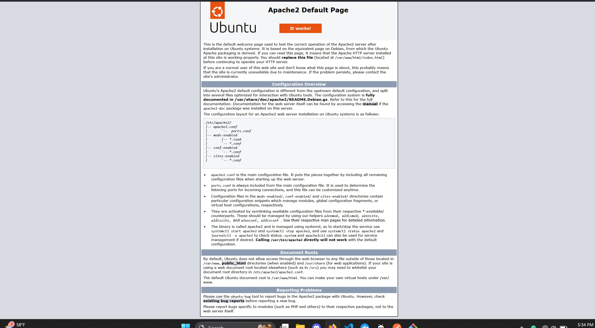
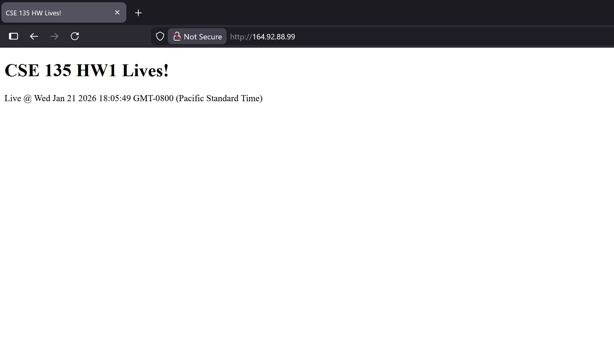
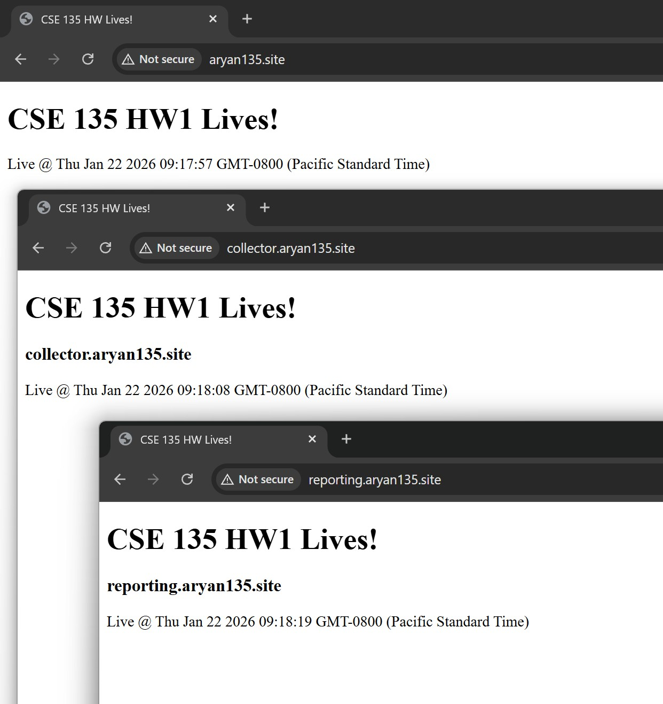
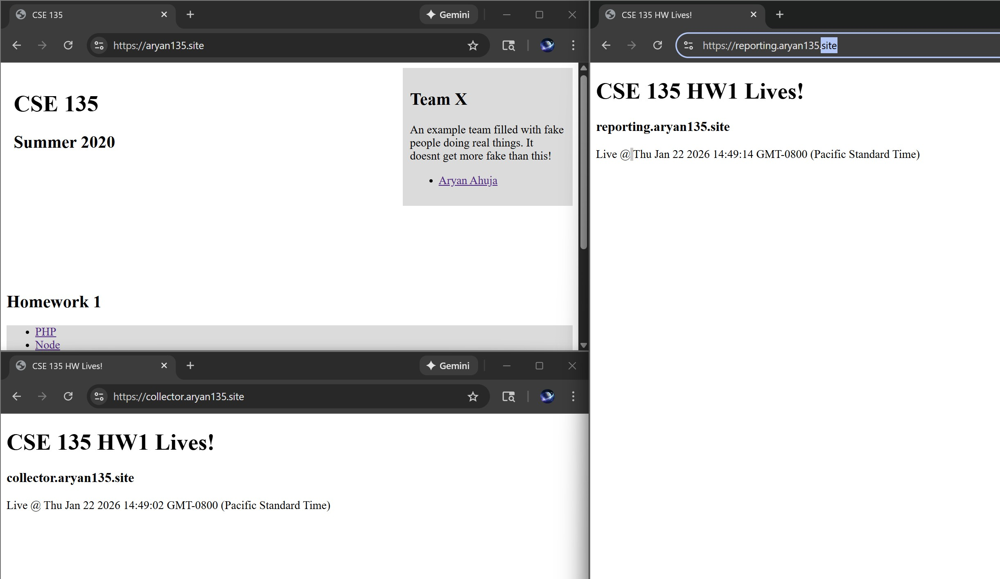
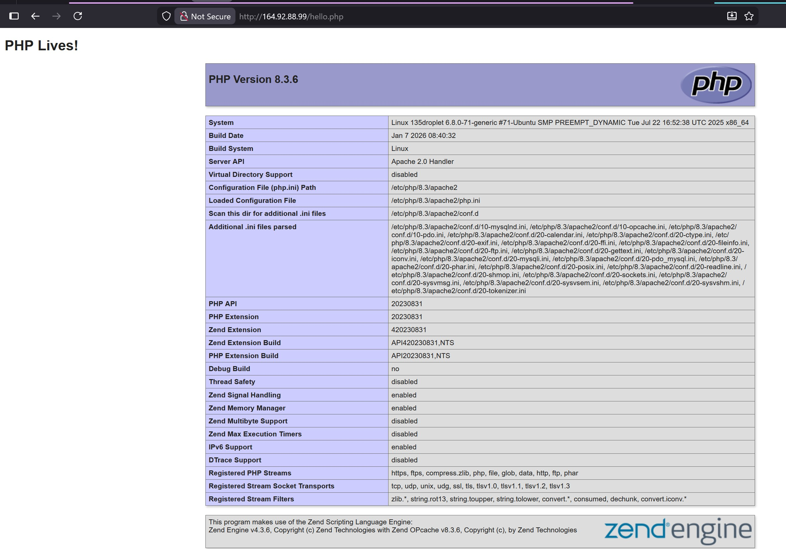
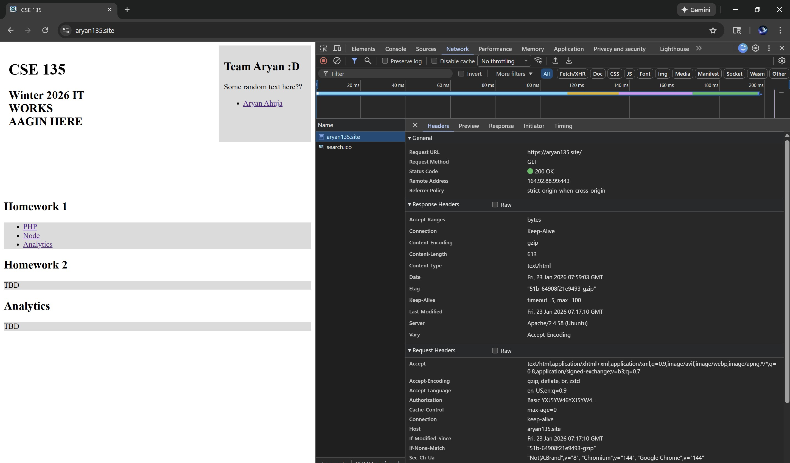
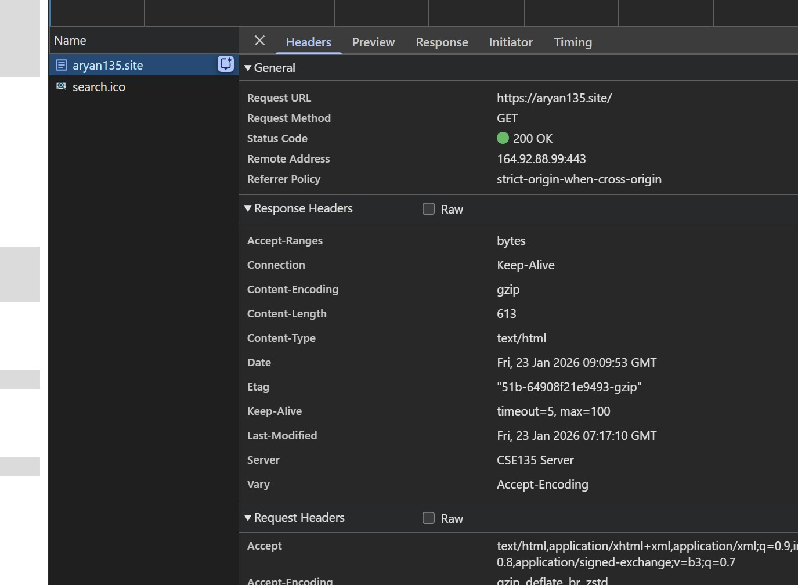
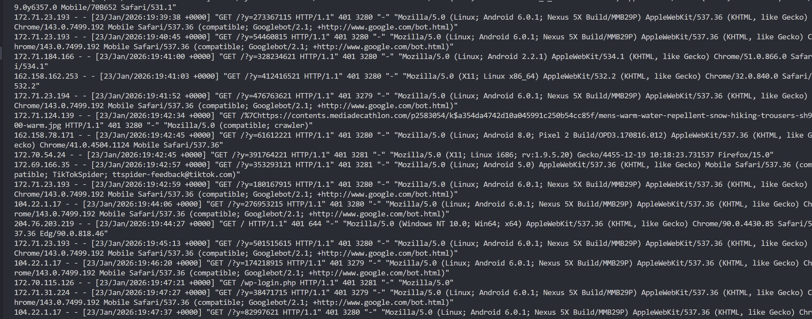

# aryan135site

## Team Members (Solo):
1. Aryan Ahuja

github link: https://github.com/pycoder49/aryan135site

## Grader Account
Server IP: 164.92.88.99

**username:** grader 
**password:** grader 
*Successfully logged in to grader on my local machine*

## My Domain
https://aryan135.site

## GitHub Auto Deployment Setup
I set up a git-based deployment workflow so the website is never edited in real time directly on the server and is instead deployed automatically from GitHub. All the files that are essential for the website live in that github repo. Once a push is made, it triggers the GitHub Actions, and connects to eht DigitalOcean droplet over SSH using GitHub repository secrets. It then navigates to the Ubuntu server's app directory, pulls the changes that were just pushed from GitHub, and then deploys the site to Apache's webroot using `rsyn`.

The `rsync` command mirrors the repository contents into `/var/www/aryan135.site/public_html`, ensuring the live site always matches the repo. So the repo has it's own path in the server, and there's the `/var/www/aryan135.site/public_html` directory that we made (and this is the deployed directory)

So the pipeline goes like this:
1. Local edits (from anywhere)
2. push to GitHub
3. trigger deploy.yml
4. changes get pulled into repo dir on server
5. `rsync` syncs repo dir and `/var/.../public_html`
6. new changes are reflected on domain

## Website Log-in Authentication
**username**: aryan 
**password**: aryan 

## Compression Summary
**For Part 3 Step 5 (Compression):**

I used the `mod_deflate` module. It was enabled through apache, and after enabling compression, the HTML, CSS, and JS responses were showed with the gzip encoding. If you inspected the tab, went to network, and reloaded the page (and then looked for "Content-Encoding") field, you would see that the content served was compressed before being set to the client.

## Renaming Server Header
**For Part 3 Step 6 (Server name change inside headers):**
Guide followed: https://www.tecmint.com/change-apache-server-name-to-anything-in-server-headers/

To change the http server response hader from the default Apache one to a custome "CSE135 Server" one, I had to configure Apache to explicitily override it using the headers module. I enabled Apache's mod_headers module (found online), which allows the modification of response headers. I then added a header override rule inside my site's SSL virtual host config file to always set the Server header to the custome one. That ensured that change applied to the headers. I also changed "ServerTokens" and "ServerSignature" inside the security.conf config file. Then I restarted the apache2 service and it worked!

# Images (inside `images` folder)
1. **initial-index.jpg**

2. **modified-index.jpg**

3. **validator-initial.jpg**

4. **vhosts-verify.jpg**

5. **ssl-verify.jpg**

6. **GitHub deployment process: gif format**

7. **php-verification.jpg**

8. **compress-verify.jpg**

9. **header-verify.jpg**

10. **error-page.jpg**

11. **log-verification.jpg**

12. **report-verification.jpg**

